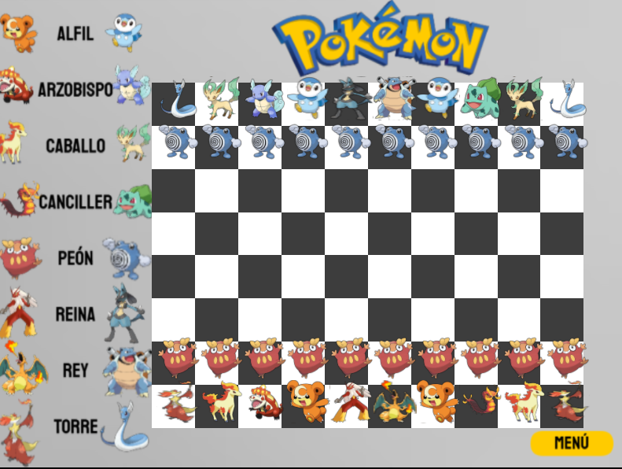
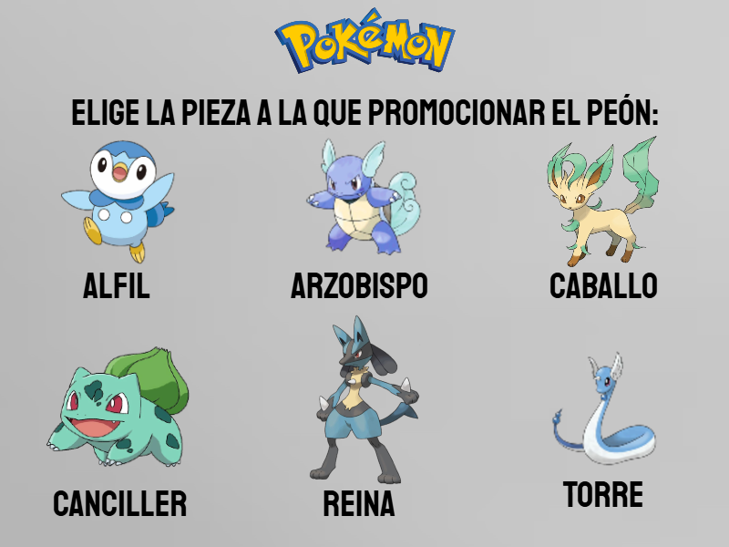
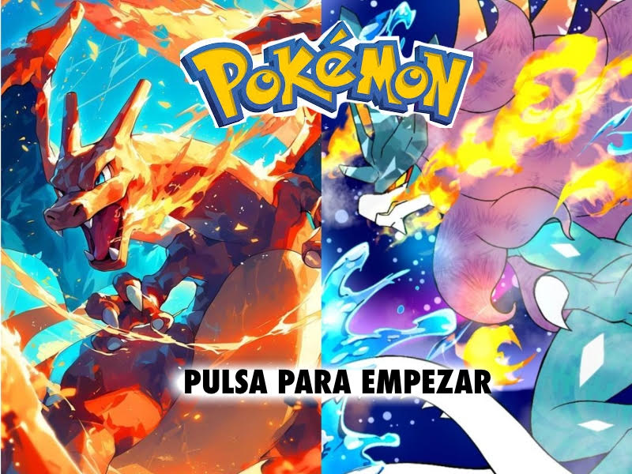

# ♟️ AJEDREZ POKÉMON

**Versión extendida de ajedrez en C++** con personajes de Pokémon como piezas, jugabilidad 1vs1 y contra la máquina, promoción personalizada de peones y diseño gráfico temático.

## Descripción del Proyecto

Este proyecto recrea un juego de ajedrez clásico con las siguientes particularidades:

- Modos de juego: Jugador vs Jugador y Jugador vs Máquina.
- Pieza promocionada con elección de Pokémon personalizados.
- Enroques, jaque, jaque mate y tablas implementados.
- IA básica para el oponente controlado por máquina.
- Interfaz visual con imágenes de Pokémon y menús.
- Interacción mediante clics y selección de casillas.

---

## Capturas

Tablero Pokémon



Promoción de peón  


Menú principal  



##  Tecnologías Usadas

- **Lenguaje:** C++
- **Gráficos:** OpenGL + [ETSIDI](https://github.com/Etsidi/ETSIDI)
- **Entorno:** Visual Studio 2022 (recomendado)
- **Estilo gráfico:** Texturas personalizadas con personajes de Pokémon

---

### Estructura del Proyecto

```
AJEDREZ_POKÉMON/
│
├── src/
│   ├── main.cpp
│   ├── control.cpp/h
│   ├── mundo.cpp/h
│   ├── tablero.cpp/h
│   ├── pieza.cpp/h
│   ├── clases de piezas (reina, rey, etc)
│   └── vector2D.h
│
├── imagenes/
│   ├── inicio.png
│   ├── tableroconmenu.png
│   ├── peonfinalazul.png
│   └── ... (sprites de Pokémon)
│
└── README.md
```


## Funcionalidades Clave

- Movimiento legal de piezas
- Turnos por color
- Selección visual y casillas destacadas
- Promoción con selección de Pokémon
- Tablas y condiciones de victoria
- IA que mueve automáticamente tras el jugador

---

##  Notas Técnicas

- El sistema de turnos está basado en el atributo `color` de las piezas.
- El movimiento de IA se activa cuando `tipo_oponente == 1`.
- La promoción de peones muestra una pantalla diferente para cada color y asigna la nueva pieza tras clic sobre el sprite correspondiente.

---

##  Autores

-  Proyecto desarrollado por Marina Moreno, Alba Martínez, Paula Verdejo, Laura Sánchez y Miguel Olalla.
- Con fines didácticos y creativos.

---

## Licencia

Este proyecto se distribuye bajo licencia MIT. Las imágenes de Pokémon son propiedad de sus respectivos creadores y se utilizan sin fines comerciales.


